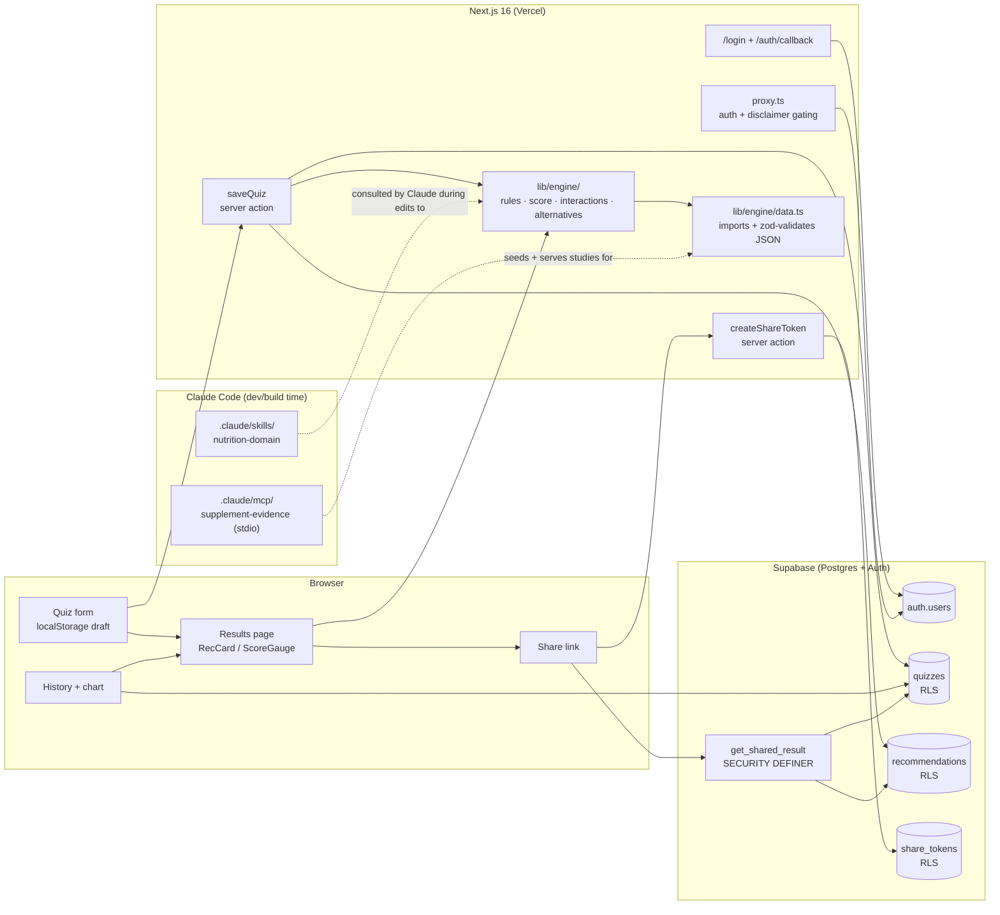

# VitaPath

> Personalized vitamin and supplement recommender. Take a short quiz, get an
> explainable health score and recommendations cited against real evidence,
> with warnings before they collide with your medications.

[**Live demo →**](https://vitamin-chi.vercel.app/)

[cc]: https://docs.anthropic.com/en/docs/claude-code

## What it does

- **5-step quiz** captures basics, diet, sleep, stress, and lifestyle.
- **Pure rule-based recommendation engine** maps quiz answers to a deduped
  list of supplements with rationale + dose, source-of-truth files in the
  `nutrition-domain` Skill.
- **Explainable health score (0–100)** with a per-rule contribution
  breakdown — every point of the score is traced back to a specific signal.
- **Safety checker** surfaces drug-supplement, supplement-supplement, and
  pregnancy contraindication warnings (e.g. St John's Wort + SSRI is
  flagged at high severity, with the medication name verbatim).
- **Cost-optimized alternative brand** for each rec — toggle between the
  curated primary pick and the cheapest brand that still meets the dose.
- **Shareable read-only link** at `/r/<token>` (30-day expiry, served via a
  Postgres `security definer` RPC so it works without auth).
- **History + Recharts trend chart** of past quizzes, each row deep-linkable
  to a frozen result page.
- **Disclaimer + age gating** — under-18 users are routed to a pediatrician
  explainer rather than the quiz; pregnancy is captured up-front.
- **Magic-link auth** via Supabase + Next.js 16 `proxy.ts` (formerly
  `middleware.ts`), cookies refreshed on every request.

## Architecture



**Key decisions**

- Engine is a pure module: the rules, score, and interaction checker are
  unit-testable functions with no I/O. The Next server action wires them up
  to Supabase and persists the snapshot.
- The `nutrition-domain` Skill is the canonical home for RDAs,
  contraindications, and interactions. Reference JSON is imported directly
  into `lib/engine/data.ts` and validated by Zod schemas at module load —
  bad data fails at boot, never at request time.
- The `supplement-evidence` MCP server is a **dev-time** tool: it runs over
  stdio when Claude Code is editing the project, and serves the same
  curated `supplements.json` that Next bundles for the runtime citation
  display.

## Tech stack

| Layer        | Choice                                                     |
| ------------ | ---------------------------------------------------------- |
| Framework    | Next.js 16 (App Router, TypeScript) on Vercel              |
| UI           | Tailwind CSS v4, Recharts                                  |
| Auth + DB    | Supabase (Postgres + magic-link auth, RLS on every table)  |
| Validation   | Zod (engine refs, quiz schemas, server-action inputs)      |
| Tests        | Vitest (engine unit) + Playwright (Chromium e2e)           |
| Claude Code  | `nutrition-domain` Skill + `supplement-evidence` MCP server |

## Local development

```bash
npm install
cp .env.example .env.local  # fill in Supabase keys
npm run dev                 # http://localhost:3000
```

### Required environment variables

```bash
NEXT_PUBLIC_SUPABASE_URL=https://<project>.supabase.co
NEXT_PUBLIC_SUPABASE_ANON_KEY=<anon key>
SUPABASE_SERVICE_ROLE_KEY=<service role key>   # used by tests + verify scripts
NEXT_PUBLIC_SITE_URL=http://localhost:3000      # production: your Vercel URL
```

### Database setup

1. Create a free Supabase project at [supabase.com](https://supabase.com).
2. Open SQL Editor → paste [`supabase/migrations/0001_init.sql`](./supabase/migrations/0001_init.sql) → Run.
3. From the repo root: `npm run verify:db` — confirms tables + RLS + RPC.

### Production: Vercel

1. Push this repo to GitHub.
2. Import into Vercel → set the same env vars.
3. Under **Authentication → URL Configuration** in Supabase:
   - Site URL: `https://<your-vercel-domain>/`
   - Redirect URLs: `https://<your-vercel-domain>/auth/callback`,
     `http://localhost:3000/auth/callback`

## Spec-driven development

The single source of truth for what to build (and what counts as done) is
[`spec.json`](./spec.json). For each goal, in order:

1. Implement only that goal.
2. Run the goal's `verification.command`.
3. If green, flip the goal's `status` from `pending` → `passed` and commit.
4. Move to the next goal whose dependencies are all `passed`.

| #   | Goal (one-liner)                              | Verification                     |
| --- | --------------------------------------------- | -------------------------------- |
| 1   | Scaffold + first Vercel deploy                | `npm run build`                  |
| 2   | Supabase schema + RLS + share-token RPC       | `npm run verify:db`              |
| 3   | Magic-link auth, protected /history           | `npm run test:e2e -- auth`       |
| 4   | Zod schemas for nutrition-domain refs         | `npm test -- engine/schemas`     |
| 5   | Headless MCP server verification              | (in MCP folder) `npm run verify` |
| 6   | 5-step quiz UI + localStorage draft + DB save | `npm run test:e2e -- quiz`       |
| 7   | Pure recommendation engine                    | `npm test -- engine/rules`       |
| 8   | Explainable health score                      | `npm test -- engine/score`       |
| 9   | Safety / interaction checker                  | `npm test -- engine/interactions`|
| 10  | Results page wiring engine end-to-end         | `npm run test:e2e -- results`    |
| 11  | History + score-trend chart + deep-links      | `npm run test:e2e -- history`    |
| 12  | Cost-optimized brand alternatives             | `npm test -- engine/alternatives`|
| 13  | Shareable read-only `/r/[token]`              | `npm run test:e2e -- share`      |
| 14  | Disclaimer + age/pregnancy gating             | `npm run test:e2e -- gating`     |
| 15  | README + architecture + final deploy          | (this file)                      |

## Claude Code integration

### `nutrition-domain` Skill (`.claude/skills/nutrition-domain/`)

A reusable knowledge module Claude consults whenever it edits files under
`lib/engine/`. Contains:

- `SKILL.md` — when to invoke, rules of thumb (UL respect, pregnancy
  gating, drug-name verbatim warnings, synergy-as-rationale).
- `references/nutrient_rdas.json` — RDAs by age band and sex.
- `references/interactions.json` — drug-supplement and
  supplement-supplement pairs with severity + summary.
- `references/contraindications.json` — `remove` / `warn` actions per
  supplement+condition pair.

The engine imports these JSON files directly and validates them against
Zod schemas at module load, so adding a new contraindication is just an
edit to the JSON.

### `supplement-evidence` MCP server (`.claude/mcp/supplement-evidence/`)

Local stdio MCP server registered in `.mcp.json` at the repo root.
Exposes:

- `get_supplement(slug)` → metadata
- `list_studies(slug)` → all cited studies
- `search_evidence(slug, concern)` → studies filtered by concern tag

```bash
# Headless verification (used by spec.json goal 5)
npm --prefix .claude/mcp/supplement-evidence run verify

# Interactive Inspector UI (manual smoke check)
npm --prefix .claude/mcp/supplement-evidence run inspect
```

The server reads the same `data/supplements.json` that the Next.js app
bundles for runtime citation display, so curated study additions show up
in both the Inspector and the live results page.

## Manual demo checklist

Run after each major change to confirm nothing regressed:

1. **Sign up via magic link** — `signInWithOtp` from `/login`, complete
   the round-trip; `/history` becomes accessible.
2. **Healthy adult quiz** — finish the quiz with reasonable answers; the
   results page should show ≥3 recs, each with a cited study and a
   non-zero health score.
3. **Pregnancy quiz** — re-take selecting `pregnancy_status: yes`;
   confirm folate, iron, omega-3 all appear; no warnings unless you also
   select medications.
4. **Drug interaction** — re-take selecting `medications: ssri`; the
   results page must surface a high-severity warning if any rec
   interacts (St John's Wort doesn't currently fire from the rules
   engine, so this is mostly exercised by the unit tests).
5. **Cost alternative** — click "See cheaper alternative" on any rec;
   the brand name + monthly price update without page reload.
6. **Share link** — click "Share this result" on `/results`, copy the
   URL, open it in a private window; the read-only view renders without
   the `/quiz` and `/history` CTAs.
7. **History trend** — take 2 quizzes, hit `/history`; the trend chart
   shows 2 plotted points and the rows deep-link to frozen results.
8. **Under-18 gate** — start a fresh quiz, select age `13-18` → routed
   to `/under-18`, draft cleared.
9. **Lighthouse** — open the live URL in Chrome DevTools → Lighthouse →
   Mobile → Performance + Accessibility ≥ 90 on `/` and `/results`.

## Testing

```bash
npm test                    # vitest — engine + schemas + alternatives
npm run test:e2e            # full Playwright suite
npm run test:e2e -- gating  # filter by spec name
```

At the time of writing: **45/45 vitest** + **14/14 e2e** in <60s combined.

## Repo layout

```
vitapath/
├─ spec.json                          # source of truth for goals + verification
├─ .mcp.json                          # registers the MCP server
├─ .claude/
│  ├─ skills/nutrition-domain/         # Claude consults this when editing lib/engine
│  └─ mcp/supplement-evidence/         # stdio MCP server (curated supplements + studies)
├─ app/
│  ├─ (marketing)/page.tsx             # Landing
│  ├─ login/                           # Magic-link form + server action
│  ├─ auth/{callback,signout}/         # Code exchange + sign-out route handlers
│  ├─ disclaimer/                      # Acknowledgement gate
│  ├─ quiz/[step]/                     # 5-step quiz, URL-routed
│  ├─ results/, results/[id]/          # Latest + frozen result views
│  ├─ history/                         # List + Recharts trend
│  ├─ r/[token]/                       # Public shareable read-only result
│  └─ under-18/                        # Pediatrician explainer
├─ lib/
│  ├─ engine/                          # rules, score, interactions, alternatives, data, schemas (Zod)
│  ├─ quiz/                            # per-step Zod schemas + localStorage helpers
│  ├─ results/, history/, share/       # Server-side data assemblers + RPCs
│  └─ supabase/                        # SSR-aware client factories (server, client, admin)
├─ proxy.ts                            # Next.js 16 renamed middleware — auth + disclaimer gate
├─ supabase/migrations/0001_init.sql   # Schema + RLS + share RPC + verify helper
├─ scripts/verify-db.mjs               # Goal 2 verification
└─ tests/                              # Vitest co-located + Playwright /tests/*.spec.ts
```

## License

MIT — coursework project.
